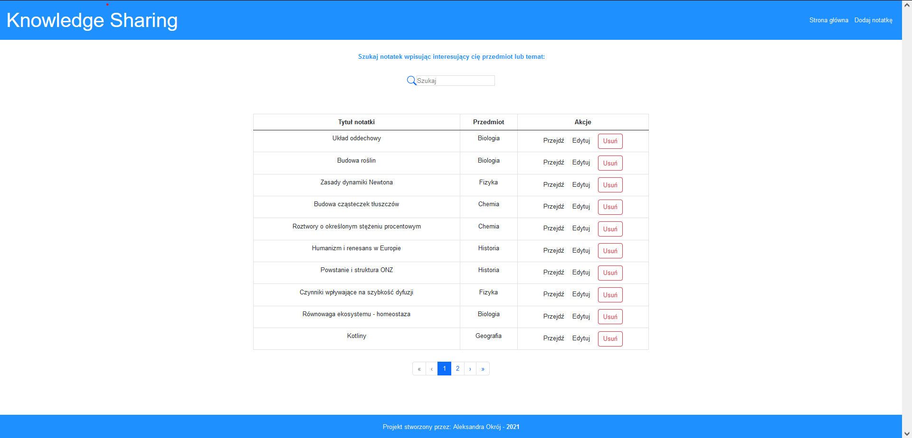
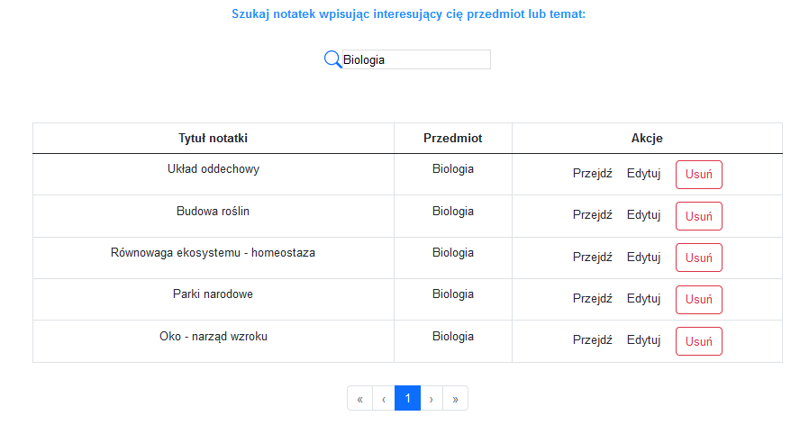
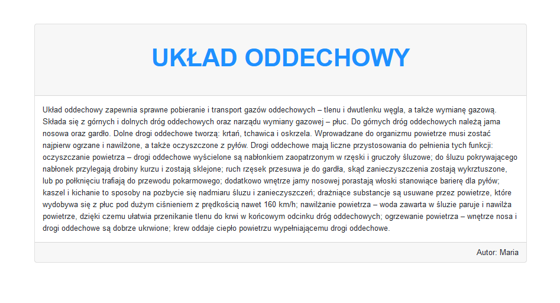
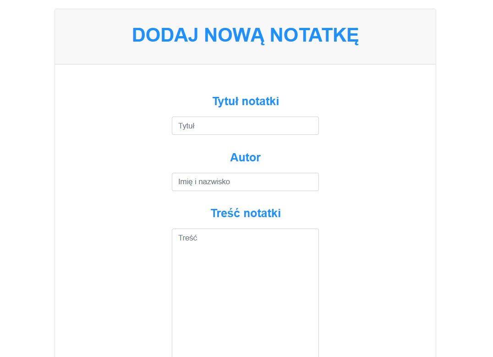
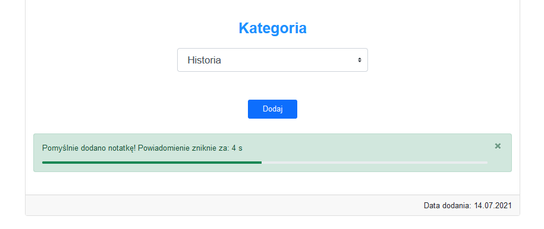
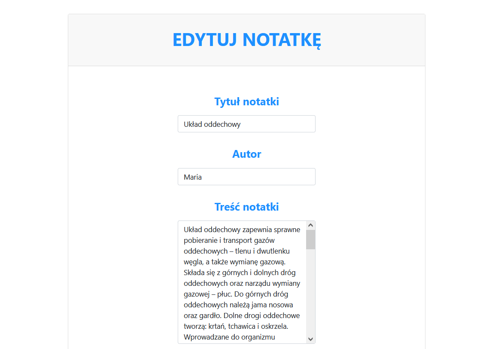

# KnowledgeSharing
Portal enabling sharing short school notes between highschool students. Uses previously created .NET Core api available for download [here](https://github.com/aleksandraokroj/KnowledgeSharing-API)

## Functionalities 

### HomePage 
All of the notes listed in the table. You can go view, edit or delete them. 

### Search bar 

### View post 

### Add post 

### Edit post 

